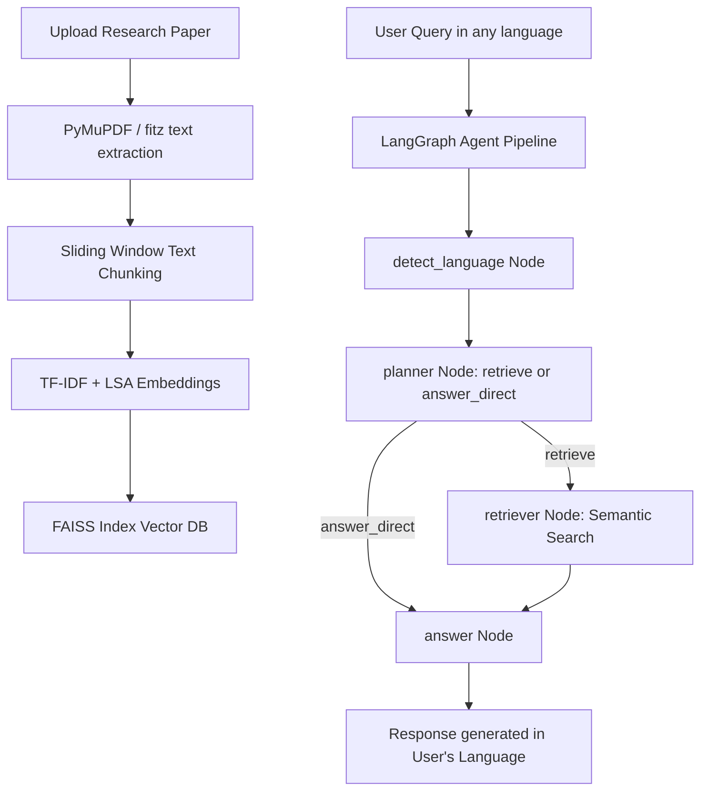

# 📄 Research Paper Assistant

A premium, modern, and highly interactive **Research Paper Assistant** that allows users to upload scientific papers, automatically extract summaries, contributions, and key technical terms, and chat with the document using an advanced semantic RAG (Retrieval-Augmented Generation) pipeline.

Powered by **FastAPI**, **Vanilla CSS & JS**, **FAISS Vector Store**, **Groq LLM (LLaMA-3)**, and **LangGraph** orchestrations.

---

## 🚀 Key Features

*   **📤 Seamless PDF Upload**: Drag-and-drop or click to index any research paper in seconds.
*   **📊 Automated Analysis**:
    *   **📝 Show Summary**: Dynamically summarizes the goals, methodology, and key results of the paper.
    *   **🏆 Key Contributions**: Extracts the primary scientific and technical novelties of the research.
    *   **🔑 Explain Technical Terms**: Lists and defines 5-8 complex concepts, algorithms, or acronyms.
*   **💬 Contextual Q&A**: Chat directly with the paper to ask questions about equations, datasets, or claims.
*   **🌐 Multilingual Capabilities**: Detects your query language automatically and responds in the same language.
*   **✨ Premium Design**: Modern dark mode, glassmorphism panel styling, loading typing indicators, page reference tags, and full responsiveness.

---

## 🏗️ Architecture Flow



---

## 🛠️ Local Installation & Setup

### Prerequisites
*   Python 3.10+
*   Groq API Key (get a free key at [console.groq.com](https://console.groq.com))

### 1. Clone the repository
```bash
git clone https://github.com/adithyangireeshkumar/CHATBOT.git
cd CHATBOT
```

### 2. Install dependencies
```bash
pip install -r requirements.txt
```

### 3. Setup your Environment Variables
Create a file named `.env` in the `backend/` directory:
```env
GROQ_API_KEY=your_groq_api_key_here
```

### 4. Run the Backend Server
```bash
python backend/main.py
```
The server will start running at `http://127.0.0.1:8000`.

### 5. Launch the Frontend
Simply double-click the **`index.html`** file in the root folder or serve it locally.


